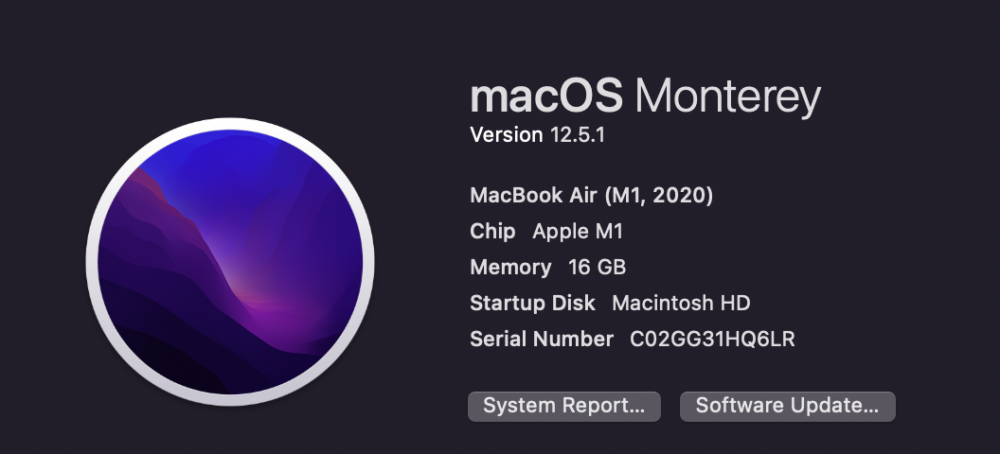
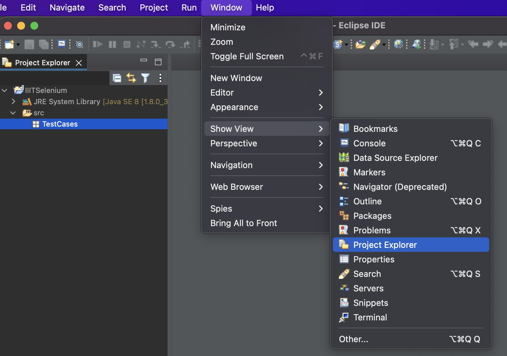

   
                

> Selenium is a tool to automate web-app's testing.

Java version: Use Java 8 only to avoid trouble.

Selenium IDE: https://tinyurl.com/yyfepnws

Eclipse IDE for Enterprise Java and Web Developers: https://tinyurl.com/2dpndpf4

Selenium server and client for language: https://www.selenium.dev/downloads/

Chrome driver: https://chromedriver.chromium.org/downloads

My system specs:

 

# Issues Encountered
1. Configuring selenium jars in eclipse project  
[Solution](https://stackoverflow.com/questions/52245708/the-type-org-openqa-selenium-chrome-chromedriver-is-not-accessible): 
Set java compiler to 1.8 or lower-  
a. Right click the project > properties > Java Compiler  
b. Uncheck the "Use compliance from execution environment ...."  
c. Set compiler compliance level to 1.8 or lower (that you have in your system)

 

 
 2. If file (or project) explorer is missing in a workspace:

 
